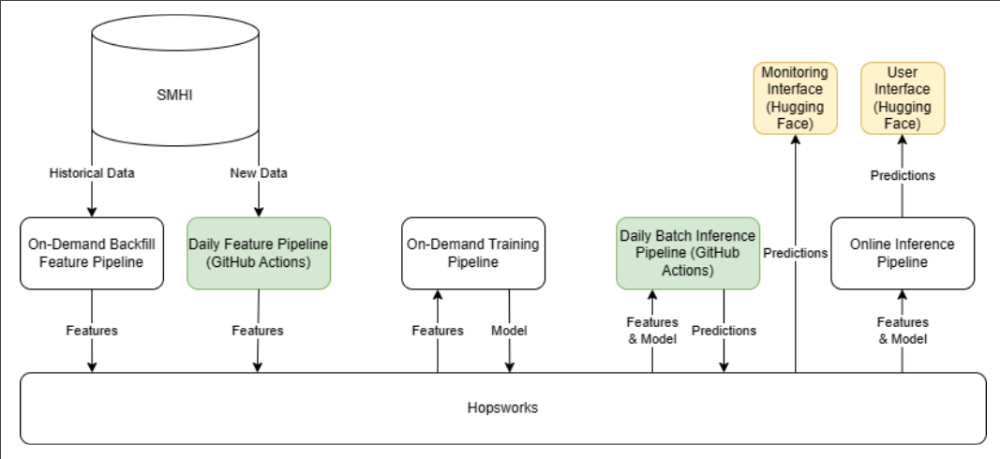

Carl Peterson & Erik Persson

Huggingface app: [Temperature](https://huggingface.co/spaces/Oxel40/Temperature)
Huggingface monitor: [Temperature-monitor](https://huggingface.co/spaces/Oxel40/Temperature-monitor)

# ID2223 Project - Predicting air temperature in Stockholm
In this project we have a serverless ML system that predicts the air temperature in Stockholm for every hour in the upcoming 24 hours. 

## How to run the code
The code consists of five different parts, backfilling, model training, batch inference, feature pipeline, and front facing monitoring and app.

Backfilling is done in two parts, first you run the bash script `fetch.sh` inside of the data directory in order to fetch all data from SMHI, then you run the jupiter notebook `temperature-backfill.ipynb` to process the data and upload it to Hopsworks.

The model training is done by running the jupiter notebook `temperature-training-pipeline.ipynb`. This trains the model (and its accompanying scaler) and uploads them to Hopsworks.

Batch inference can be run using the python script `temperature-batch-inference-pipeline.py`.

The feature pipeline fetches new data from SMHI and uploads it to Hopsworks, this is ran by the python script `temperature-batch-inference-pipeline.py`

The monitoring and app needs to be run in a python environment with Gradio, we are using Huggingface spaces for this.

## Data
The data that we have used in this project is meteorological data from [Sveriges meteorologiska och hydrologiska institut (SMHI)](https://www.smhi.se/), which is a Swedish authority that collects and predicts weather, water and climate data. Since there is a lot of data available, we have restricted our data gathering in some ways.

Because we want to predict the temperature in Stockholm, data should be collected from measuring stations in Stockholm. Our first initial thought was to gather data from several different stations in the Stockholm area to acquire as much data as possible. However, many of the measuring stations did not measure the same parameters, and had not done so historically either, which made it difficult to combine the data from the different stations. We were also unsure whether it would be feasible to use different parameters from different stations or not, so at the end we only decided to use data from the measurement station in Tullinge (id [97100](https://www.smhi.se/data/meteorologi/ladda-ner-meteorologiska-observationer#param=airtemperatureInstant,stations=core,stationid=97100)) since this station measures almost all available parameters.

As mentioned there are a lot of available parameters to choose from, and some of them are measured in different time intervals, with the most common time interval being hourly. Because of this and the fact that we want to predict the temperature by the hour, we decided to only use data that is measured with hourly time intervals. Some of the non-hourly measurements are also redundant which makes it reasonable not to use them. For instance the parameter air temperature is available hourly, weekly and monthly.

Another problem with the parameters is that they have been started to be measured at different times historically, so some parameters have more measurements than others. We chose to solve this by only using data from the time when all the parameters have measurements. There were also some historical values missing, which we solved by interpolating them.

At last we ended up with historical hourly data from **1996-02-01 22:00:00**, with the following parameters/features:

- Air temperature
- Wind direction
- Wind speed
- Relative humidity
- Precipitation
- Sight
- Maximum of average wind speed
- Dew point temperature

## Model
The model we ended up with is a multi-layered feed forward neural network (using Keras/Tensorflow) with an accompanying data scaler from scikit-learn. The network consists of one input layer of 216 features, followed by three dense layers of size 150, 100 and 50 using the ReLU activation function, followed by one dense layer of size 9 without any activation function. This last layer is the output layer of the network. The input to the network is a feature window of the latest 24 hours, with each hour having 9 features, resulting in a vector of 216 features. The output of the network is the predicted 9 features for the next following hour after the feature window. To normalize the input data we use the scaler that has been fitted to the historical dataset, and inverse scale the output data using the same scaler.

## Serverless ML system architecture
Our architecture is based around the Hopsworks feature store, GitHub actions, and Huggingface spaces. The Hopsworks feature store is the working backbone for our system, storing/serving both our dataset and prediction model. The batch inference pipeline and the feature pipeline runs once a day on GitHub actions, collecting new data and evaluating the model. Both new data and information about model performance is then stored in Hopsworks. The front facing temperature and monitor apps runs on Huggingface. They collect data and the model from Hopsworks, and displays predictions and monitor information to the user.

## Conclusions/discussion
To conclude, we have developed a serverless ML system that is capable of predicting the air temperature in Stockholm hourly in the upcoming 24 hours. The project has had its limitations, especially because of the fact that we have limited time, and there are a lot of possible improvements for the model. For instance we could have tried to combine data from several different measurement stations, even if the data obtained would include different parameters, and observe if this would have improved the model. The parameters that are not measured hourly at the stations could have tried to be incorporated as well. We could also have done more robust feature engineering to see which features are actually important for predicting the air temperature. We could have introduced/created new features derived from the available ones. 

Regarding the model we tried other architectures before we decided to use a multi-layered feed forward neural network. The first architecture we tried was a LSTM network, because of its recurrent nature we initially thought it would be a good choice for our time-series prediction problem. However, we did not manage to develop such a network with reasonable performance, which was a bit surprising. The reason for this could of course be that we did not set it up properly, but we also read a comment somewhere that LSTMs aren’t all that great on regression tasks. We also tried using some of the forecasters from the library skforecast. The problem with this library was that it was not optimal for having several parameters from several time-steps as both input and output, which made it difficult to use in our case. We also looked into using the MetNet-3 model by Google, but we found that the required input data for the model wasn’t all that easy to acquire, so we decided not to use this model. We could have performed a more thorough hyperparameter tuning as well ro improve the performance of the model we finally did choose.

To summarize, this project has been very fruitful and we have certainly learned a lot along the way.

